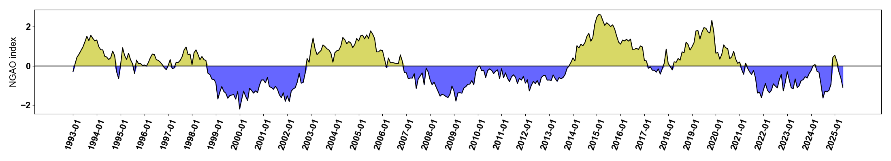
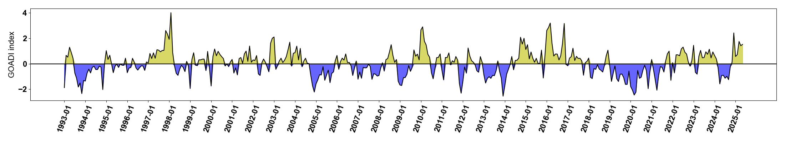

# Gulf-of-Alaska-climate-index

This repository contains the scripts and workflow needed to compute the **Northern Gulf of Alaska Oscillation (NGAO)** (see *Hauri et al., 2021*) and the **Gulf of Alaska Downwelling Index (GOADI)** (see *Hauri et al., 2021*).  

---

## Northern Gulf of Alaska Oscillation (NGAO)

The NGAO index describes the strength of the cyclonic circulation in the Gulf of Alaska, and therefore, the intensity of offshore upwelling in the Alaskan gyre and coastal downwelling (*Hauri et al., 2021*).  

The NGAO corresponds to the **primary mode of variability**, identified through Empirical Orthogonal Function (EOF) decomposition performed on SSH anomalies (with trends and monthly climatology removed).  
This first mode accounts for approximately **24% of the total variance** and explains about **50% of the SSH variance in offshore areas**.

---

## Gulf of Alaska Downwelling Index (GOADI)

The GOADI quantifies the intensity of **positive coastal SSH anomalies** in the Gulf of Alaska, indicating the strength of coastal downwelling (*Hauri et al., 2024*).  

This index is derived from the **second mode of variability** identified by EOF decomposition, applied to SSH anomalies after removing trends and monthly climatology.  
While this second mode accounts for approximately **10% of the total variance**, it explains about **60% of the SSH variance** on the continental shelf.

## Updating the NGAO / GOADI Index

**Workspace path:** `/Volumes/work/NGAO/SATELLITE/NEW`  
**Conda environment:** `remi`  
**Reanalysis data:** [DOI:10.48670/moi-00145](https://doi.org/10.48670/moi-00145)  
**Near-real-time (NRT) data:** [DOI:10.48670/moi-00149](https://doi.org/10.48670/moi-00149)

---

### 🔹 Step 1 — Download the Reanalysis SSH (if a new version is available)

As of **May 14, 2025**, the latest reanalysis version is `202411`, covering **1993-01-01 → 2024-06-14**.  
- **Product:** `c3s_obs-sl_glo_phy-ssh_my_twosat-l4-duacs-0.25deg_P1D`  
- **Scripts:** `get_HINDCAST.py`, `get_HIND.py`  
- **Output:**  c3s_obs-sl_glo_phy-ssh_my_twosat-l4-duacs-0.25deg_P1D_adt_177.88W-126.12W_40.12N-62.88N_1993-01-01-2024-06-14.nc
