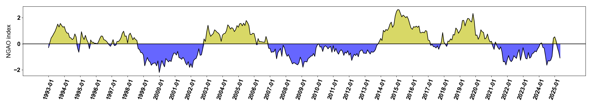
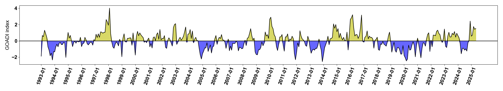

# Gulf-of-Alaska-climate-index

This repository contains the scripts and workflow needed to compute the **Northern Gulf of Alaska Oscillation (NGAO)** (see *[Hauri et al., 2021](https://doi.org/10.1038/s43247-021-00254-z)*) and the **Gulf of Alaska Downwelling Index (GOADI)** (see *[Hauri et al., 2024](https://doi.org/10.1029/2023AV001039)*).  

---

## Northern Gulf of Alaska Oscillation (NGAO)

The NGAO index describes the strength of the cyclonic circulation in the Gulf of Alaska, and therefore, the intensity of offshore upwelling in the Alaskan gyre and coastal downwelling (*Hauri et al., 2021*).  

The NGAO corresponds to the **primary mode of variability**, identified through Empirical Orthogonal Function (EOF) decomposition performed on SSH anomalies (with trends and monthly climatology removed).  
This first mode accounts for approximately **24% of the total variance** and explains about **50% of the SSH variance in offshore areas**.

---

## Gulf of Alaska Downwelling Index (GOADI)

The GOADI quantifies the intensity of **positive coastal SSH anomalies** in the Gulf of Alaska, indicating the strength of coastal downwelling (*Hauri et al., 2024*).  

This index is derived from the **second mode of variability** identified by EOF decomposition, applied to SSH anomalies after removing trends and monthly climatology.  
While this second mode accounts for approximately **10% of the total variance**, it explains about **60% of the SSH variance** on the continental shelf.

---

## ✅ Updating the NGAO / GOADI Index

**Workspace path:** `/Volumes/work/NGAO/SATELLITE/NEW`  
**Conda environment:** `remi`  
**Reanalysis data:** [DOI:10.48670/moi-00145](https://doi.org/10.48670/moi-00145)  
**Near-real-time (NRT) data:** [DOI:10.48670/moi-00149](https://doi.org/10.48670/moi-00149)

---

### 🔹 Step 1 — Download the Reanalysis SSH (if a new version is available)

As of **May 4, 2026**, the latest reanalysis version is `202411`, covering **1993-01-01 → 2024-05-01**.  
- **Product:** `c3s_obs-sl_glo_phy-ssh_my_twosat-l4-duacs-0.25deg_P1D`  
- **Scripts:** `get_HINDCAST.py`, `get_HIND.py`  
- **Output:**  
  `c3s_obs-sl_glo_phy-ssh_my_twosat-l4-duacs-0.25deg_P1D_adt_177.88W-126.12W_40.12N-62.88N_1993-01-01-2025-05-01.nc`

---

### 🔹 Step 2 — Download Near-Real-Time (NRT) SSH

This step is run each time the index is updated.

⚠️ :As of May 2026

| Resolution | Period                   |  Product ID                                                 |
|------------|--------------------------|-------------------------------------------------------------|
| 0.125°     | 2024-11-20 → nrt         | `cmems_obs-sl_glo_phy-ssh_nrt_allsat-l4-duacs-0.125deg_P1D` |

Version : `202506`

**Script:**
⚠️  `get_NRT.py` — downloads the 0.25° segment ⚠️  NOW DEPRECIATED 
- `get_NRT0125.py` — downloads the 0.125° segment

---

### 🔹 Step 3 — Interpolate 0.125° onto the 0.25° Grid

- **Script:** `interp_0125_on_025.py`  
- **Output:** `adt_from_0125_on_025.nc`

⚠️ The land mask in 0.125° is coarser. Run `mask_reana.py` to match the reanalysis land mask.

---

### 🔹 Step 4 — Concatenate All Files

**First**, eme the hindcast part: 
`ln -sfv c3s_obs-sl_glo_phy-ssh_my_twosat-l4-duacs-0.25deg_P1D_adt_177.88W-126.12W_40.12N-62.88N_1993-01-01-2025-05-01.nc adt_native_025_reana_nrt_concat.nc` 

        
**Second**, concatenate the reanalysis and 0.25° NRT last part:

        cdo cat adt_native_025_reana_nrt_concat.nc adt_from_0125_on_025.nc adt_full_on_025.nc
---
### 🔹 Step 5 — *(Optional)* Interpolate ROMS Domain onto the 0.25° Grid

This step is only needed if the data grid has changed.  
The `mask_roms_on_025.nc` file is provided and does not need to be regenerated unless the spatial resolution or domain has been altered.

- **Script:** `interp_roms_on_025.py`  
- **Output:** `mask_roms_on_025.nc` (binary mask: `0 = outside ROMS`, `1 = inside`)

---

### 🔹 Step 6 — Compute Monthly Averages

Generate a monthly mean version of the merged time series:
cdo monmean adt_full_on_025.nc adt_full_on_025_monthly.nc

### 🔹 Step 7 — Compute NGAO / GOADI Index

This step involves performing the EOF decomposition and extracting the principal modes of SSH variability to compute both the **NGAO** and **GOADI** indices.

- **Script:** `ngao_compute_month.py`  
  This script:
  - Performs detrending and climatology removal
  - Runs EOF analysis on SSH anomalies
  - Saves the resulting indices as `.csv` and `.npy` files

