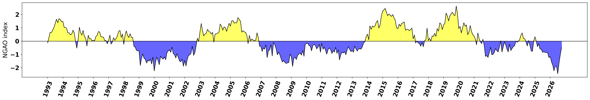
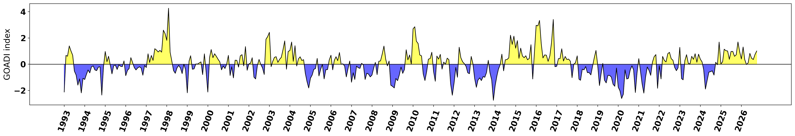

# Gulf of Alaska Climate Indices — NGAO & GOADI

This repository provides a reproducible workflow for computing and updating two Gulf of Alaska circulation indices from satellite absolute dynamic topography (ADT):

- **Northern Gulf of Alaska Oscillation (NGAO)** — Hauri et al. (2021), [doi:10.1038/s43247-021-00254-z](https://doi.org/10.1038/s43247-021-00254-z)
- **Gulf of Alaska Downwelling Index (GOADI)** — Hauri et al. (2024), [doi:10.1029/2023AV001039](https://doi.org/10.1029/2023AV001039)

The workflow retrieves Copernicus Marine satellite altimetry data, combines the reprocessed and near-real-time records, applies a fixed Gulf of Alaska model-domain mask, computes monthly anomalies and EOFs, and generates updated index values and figures.

The project is being developed as a reproducible, production-style scientific workflow while preserving the original scientific methodology used to define the indices.

---

## Northern Gulf of Alaska Oscillation (NGAO)

The **NGAO** describes variations in the strength of cyclonic circulation in the Gulf of Alaska and therefore changes in offshore upwelling in the Alaskan gyre and coastal downwelling.

The NGAO corresponds to the **first principal component (PC1)** of an Empirical Orthogonal Function (EOF) decomposition of detrended and deseasonalized sea-surface height variability.



---

## Gulf of Alaska Downwelling Index (GOADI)

The **GOADI** describes variations in positive coastal sea-surface height anomalies associated with coastal downwelling in the Gulf of Alaska.

The GOADI corresponds to the **second principal component (PC2)** of the EOF decomposition.



---

## Data

The current workflow uses the Copernicus Marine **0.125° all-satellite DUACS ADT products**.

### Reprocessed record

```text
cmems_obs-sl_glo_phy-ssh_my_allsat-l4-duacs-0.125deg_P1D
```

The reprocessed dataset provides the historical record beginning in January 1993.

### Near-real-time record

```text
cmems_obs-sl_glo_phy-ssh_nrt_allsat-l4-duacs-0.125deg_P1D
```

The workflow automatically determines the last available date in the reprocessed product and starts the NRT request on the following day.

This avoids hard-coded handoff dates between the historical and operational products.

Only the `adt` variable is required.

---

## Scientific workflow

The scientific processing follows the original NGAO/GOADI implementation.

```text
Copernicus reprocessed ADT
             +
Copernicus NRT ADT
             |
             v
     concatenate daily data
             |
             v
     validate daily time axis
             |
             v
       monthly averages
             |
             v
      apply ROMS mask
             |
             v
   quadratic detrending
         order = 2
             |
             v
 additive seasonal decomposition
         period = 12
             |
             v
   remove seasonal component
             |
             v
      EOF decomposition
          /       \
        PC1       PC2
         |         |
       NGAO      GOADI
```

Important scientific choices from the original implementation are intentionally preserved:

- quadratic detrending using `statsmodels.tsa.tsatools.detrend(order=2)`;
- additive seasonal decomposition with a 12-month period;
- the same order of detrending and seasonal-cycle removal;
- EOF analysis using `eofs.standard.Eof`;
- principal components using `pcscaling=1`;
- PC1 identified as NGAO;
- PC2 identified as GOADI.

The modernization of the repository is intended to improve reproducibility and automation without silently changing the scientific definition of the indices.

---

## Gulf of Alaska domain mask

The analysis is restricted to the ocean portion of the NWGOA ROMS model domain.

The original ROMS grid is stored at:

```text
data/reference/roms/NWGOA_grid_3.nc
```

A fixed binary mask interpolated onto the Copernicus 0.125° grid is stored at:

```text
data/reference/masks/roms_ocean_mask_0125.nc
```

with:

```text
1 = ocean inside the ROMS domain
0 = land or outside the ROMS domain
```

The mask does **not** need to be regenerated during normal index updates.

If regeneration is required, for example after changing the spatial domain or satellite grid, use:

```bash
python scripts/build_roms_mask.py
```

---

## Repository structure

```text
Gulf-of-Alaska-climate-index/
│
├── README.md
├── LICENSE
├── pyproject.toml
├── .gitignore
│
├── src/
│   └── goa_indices/
│       ├── __init__.py
│       ├── download.py
│       ├── indices.py
│       ├── plotting.py
│       ├── validation.py
│       └── cli.py
│
├── config/
│   └── default.toml
│
├── data/
│   ├── raw/
│   │   ├── reprocessed/
│   │   └── nrt/
│   │
│   └── reference/
│       ├── roms/
│       ├── masks/
│       └── legacy_indices/
│
├── outputs/
│   ├── indices/
│   ├── figures/
│   └── qc/
│
├── scripts/
│   └── build_roms_mask.py
│
├── tests/
│
└── docs/
```

Large downloaded satellite datasets are not stored in Git.

Small reference datasets required to reproduce the analysis, including the ROMS mask and legacy NGAO/GOADI indices, are retained in the repository.

---

## Copernicus Marine authentication

A Copernicus Marine account is required to download the satellite data.

Authenticate once using:

```bash
copernicusmarine login
```

Credentials are managed by the Copernicus Marine Toolbox and are **not stored in this repository**.

---

## Running the workflow

From the repository root, run:

```bash
python -m src.goa_indices.cli
```

The workflow performs:

```text
1. Check/update Copernicus data
2. Compute NGAO and GOADI
3. Generate figures
```

The generated products are written to:

```text
outputs/indices/
outputs/figures/
```

### Run with legacy quality control

To additionally compare the new indices against the legacy implementation:

```bash
python -m src.goa_indices.cli --qc
```

QC results are written to:

```text
outputs/qc/
```

---

## Output products

### Monthly indices

```text
outputs/indices/NGAO_monthly.csv
outputs/indices/GOADI_monthly.csv
```

The CSV files contain one value per month:

```text
date,NGAO
1993-01,...
1993-02,...
...
```

and:

```text
date,GOADI
1993-01,...
1993-02,...
...
```

### Figures

```text
outputs/figures/NGAO_monthly.png
outputs/figures/GOADI_monthly.png
```

### Additional diagnostics

The workflow also produces EOF variance fractions and NumPy representations of the indices for internal processing.

---

## Validation against the legacy workflow

The new workflow uses the native **0.125° all-satellite** Copernicus product, whereas the previous implementation primarily used the **0.25° two-satellite** product.

Because the observational product changed, exact numerical equality is not expected.

The new implementation was compared against the legacy NGAO and GOADI indices over their common period from **January 1993 through May 2026 (401 months)**.

| Metric | NGAO | GOADI |
|---|---:|---:|
| Correlation | 0.9925 | 0.9913 |
| RMSE | 0.1238 | 0.1320 |
| Mean difference (new − legacy) | +0.0187 | −0.0084 |
| Legacy standard deviation | 1.0000 | 1.0000 |
| New standard deviation | 0.9892 | 1.0030 |

The correlations above **0.99**, small mean offsets, and nearly identical variance indicate that the new 0.125° workflow preserves the behavior of the original indices while substantially simplifying the data-processing pipeline.

The legacy index values used for this comparison are retained in:

```text
data/reference/legacy_indices/
```

---

## Development goals

This repository is also being used to progressively develop a production-style scientific data workflow.

Planned development includes:

- reproducible dependency management;
- automated scientific tests with `pytest`;
- continuous integration with GitHub Actions;
- automated detection and processing of new observations;
- scheduled index updates;
- improved provenance and metadata;
- containerization where useful;
- low-cost cloud/object storage where it provides a clear benefit;
- automated publication of updated indices and figures.

The guiding principle is to introduce infrastructure only when it solves a clear reproducibility, automation, or deployment problem.

---

## References

Hauri, C. et al. (2021). *A regional hindcast model simulating ecosystem dynamics, inorganic carbon chemistry and ocean acidification in the Gulf of Alaska*. Communications Earth & Environment.  
https://doi.org/10.1038/s43247-021-00254-z

Hauri, C. et al. (2024). Gulf of Alaska circulation and downwelling index study. AGU Advances.  
https://doi.org/10.1029/2023AV001039
